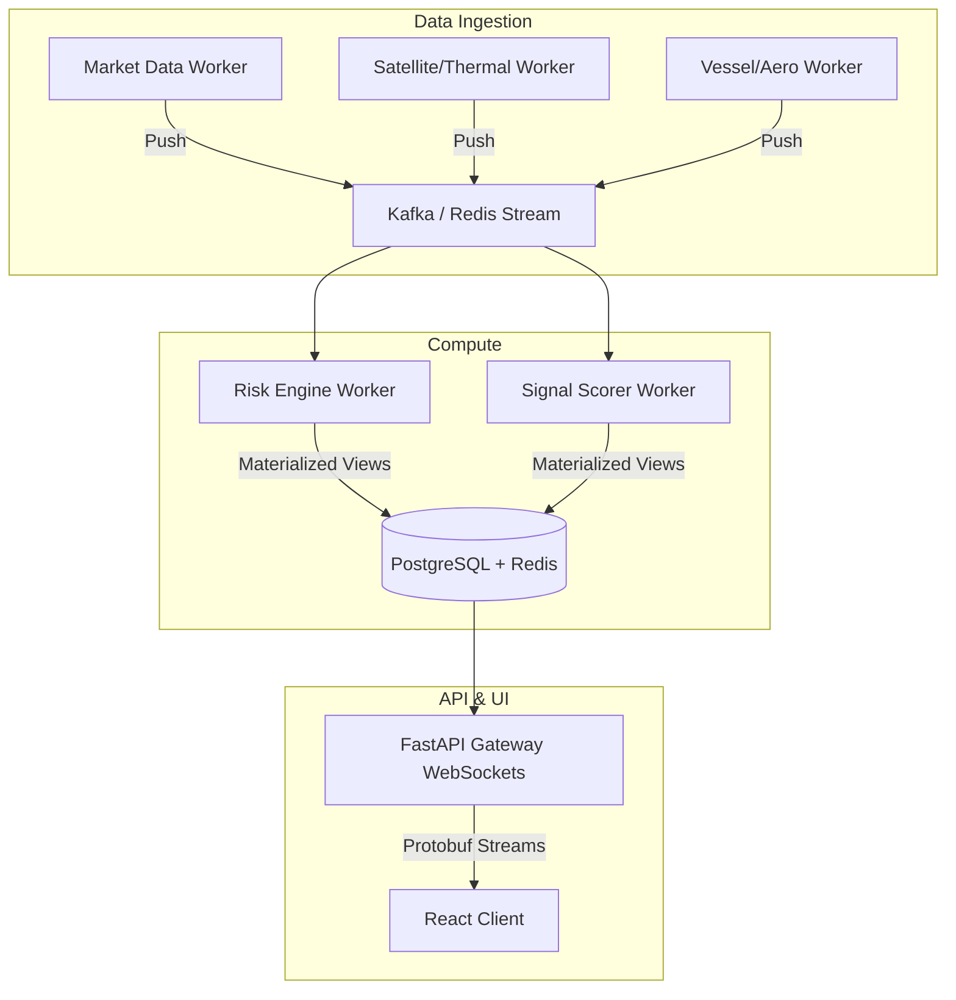

# SatTrade: FAANG-Level System Audit & Production Readiness Report

## 1. Executive Summary
This project represents a highly ambitious, advanced prototype with an impressive feature scope (satellite imaging, live AIS/ADSB tracking, AI-driven risk models, and a Bloomberg-style terminal). However, structurally, it is a **Proof of Concept (PoC)**. While the domain logic is advanced, the underlying web architecture is fundamentally unscalable and unsafe. If deployed as-is, the system will instantly collapse under the weight of 100 concurrent users due to catastrophic N+1 thread exhaustion, rate-limiting from un-cached upstream API calls, and a total lack of structured error boundaries. 

The project currently looks like it was built by an **advanced domain expert (quant/data science)** but lacks the rigorous engineering practices of a **senior distributed systems engineer**.

---

## 2. Scorecard (Out of 100)
- **Frontend / UI/UX**: 70/100 (Great visuals, terrible error boundaries and state hydration)
- **Backend Architecture**: 35/100 (Sync network calls wrapped in threads, massive bottleneck)
- **Database & State**: 20/100 (Postgres defined but unused; relying on volatile memory singletons)
- **Security**: 10/100 (Hardcoded JWT secrets, open endpoints, no rate limit)
- **Performance / Scalability**: 15/100 (O(N) scaling for WebSockets, thread exhaustion)
- **DevOps / CI/CD**: 25/100 (Dockerized, but running `--reload` locally with no pipelines)

---

## 3. Critical Issues (Breaks System / Unsafe)

1. **Catastrophic WebSocket Architecture**: 
   Inside `server.py`, `websocket_live` loops `while True: await asyncio.sleep(10)` and then calls `await asyncio.to_thread(fetch_all_aircraft)`. If 1,000 users connect, the server spawns 1,000 independent threads *every 10 seconds*, making 1,000 duplicate upstream HTTP requests. This will immediately result in thread pool exhaustion, IP bans from upstream APIs, and a complete system crash.
2. **Hardcoded Secrets**: 
   `src/api/auth.py` defines `SECRET_KEY = "sat-trade-proprietary-v1"`. This is pushed to version control.
3. **No Centralized Data Ingestion Layer**: 
   Features are tightly coupled to the HTTP layer. Clients fetching `/api/signals` trigger a synchronous chain of upstream fetches (`fetch_firms_thermal`, `get_earnings_calendar`). 
4. **Silent Frontend Failures**: 
   API fetch errors (like missing proxies) result in empty JSON objects or HTML blobs, silently breaking the UI (scrollbars disappear, inputs freeze) rather than displaying graceful error boundaries.

---

## 4. High Priority Improvements

1. **Decoupled Job Scheduler & Redis Pub/Sub**: 
   Move all `fetch_all_aircraft` and data polling into isolated background workers (e.g., Celery/RQ). Have them write state to Redis. WebSockets should ONLY read from Redis or subscribe to a Redis Pub/Sub channel. 
2. **Ditch In-Memory Singletons**: 
   `_vessel_tracker` and `_orchestrator` are instantiated locally in the uvicorn worker. In a multi-worker production environment (e.g., `uvicorn --workers 4`), state will be fragmented across processes. Move this state to Postgres/Redis.
3. **API Rate Limiting & Pagination**: 
   There is zero rate-limiting on endpoints executing heavy computational tasks (like `/api/backtest`). 
4. **Implement Global Error Boundaries**: 
   The React frontend needs top-level `<ErrorBoundary>` wrappers. Network failures must trigger "Degraded Mode" warnings rather than rendering blank screens.

---

## 5. Medium/Low Issues

- **Business Logic Co-Mingled with Mocks**: `composite_scorer.py` currently uses `import random` to simulate data if upstream is unavailable. This is highly risky for a financial system as simulated data can leak into production trades.
- **Missing CI/CD Pipeline**: No GitHub Actions for linting, running tests, or building Docker images.
- **Inefficient Payload Sizes**: The `/api/globe/aircraft` endpoint dumps entire GeoJSON collections synchronously. This payload needs compression (brotli/gzip) and delta-updates (only sending moved aircraft).
- **`--reload` in Production**: `docker-compose.yml` runs the API via `uvicorn --reload`. This watches files and consumes heavy CPU metadata. It should only be used in dev.

---

## 6. Real-World Failure Scenarios

- **Scenario 1 - Launch Day (10,000 users)**: 10,000 users open the dashboard. The server opens 10,000 WebSocket connections. Within 10 seconds, 10,000 OS idle threads are spawned to call `OpenSky/AIS` APIs. The server instantly runs out of memory (OOM), and the upstream API permabans the server IP.
- **Scenario 2 - Market Panic (High Volatility)**: `RiskEngine` Monte Carlo simulations compute VaR. 100 concurrent trade requests hit `/api/risk/evaluate`. The CPU is pegged at 100% computing Cholesky decompositions because it runs synchronously on the main thread, blocking all FastAPI network requests.
- **Scenario 3 - Malicious Actor**: A user notices `/api/risk/evaluate` takes a heavy payload. They spam it with 1,000 requests per second. The server's CPU locks up. Standard DoS vulnerability.

---

## 7. Top 0.1% Upgrade Plan

To compete with Bloomberg / Palantir, you must shift from a "Request/Response" mindset to an "Event-Driven Stream" mindset:
1. **Infrastructure**: Deploy Kubernetes (EKS/GKE). Use Kafka/Redpanda for event streaming of market/satellite ticks.
2. **Ingestion Tier**: Separate Python microservices that poll ADSB/Thermal/Market APIs independently and stream raw events to Kafka.
3. **Compute Tier**: Flink or Spark clusters subscribe to Kafka, compute IC/Risk/Signals in real-time, and sink the materialized views to Redis/PostgreSQL.
4. **API Gateway**: A lightweight Go or Rust websocket server that strictly reads the materialized views from Redis to push to clients. Zero heavy computation on the web nodes.
5. **Frontend**: Use WebWorkers to parse binary WebSocket payloads (e.g., Protobuf/FlatBuffers) instead of massive JSON to keep the main UI thread at 60fps.

---

## 8. Architecture Redesign Suggestions

---

## 9. Production Readiness Verdict

**VERDICT: NOT READY.** 
The system requires an estimated 4-6 weeks of infrastructure refactoring. The domain logic (the "brain") is brilliant, but the "nervous system" (networking, concurrency, state management) must be entirely rebuilt to prevent catastrophic failure at scale.

---

## 10. 30-Day Improvement Plan

**Week 1: Decoupling & Stability**
- Move all synchronous polling out of FastAPI and into `APScheduler` or `Celery` workers.
- WebSockets must only broadcast state from Redis, not trigger computations.
- Remove `uvicorn --reload` from Docker setups.

**Week 2: Security & Database**
- Implement strict JWT validation with environment-provided secrets and RS256.
- Hook up SQLAlchemy models to PostgreSQL; eliminate global singletons in memory.
- Add `slowapi` rate limiting to all endpoints.

**Week 3: Frontend Resilience**
- Implement React `<ErrorBoundary>` at component boundaries.
- Add Loading/Empty states for missing upstream data.
- Optimize WebSocket payloads (send only deltas/diffs).

**Week 4: DevOps & Testing**
- Write Pytest integration tests covering 80% of endpoints.
- Add GitHub Actions CI/CD to prevent regressions.
- Implement strict staging environments to separate dev mocks from production logic.

---

## Appendix: Direct Answers to Your Checks

*What exactly does this project look like?*
**Advanced Domain, Beginner Systems Architecture.** The financial and data-science math is advanced. The actual backend execution of that math over a network is beginner-level pattern application.

*Top 10 Biggest Weaknesses*
1. WebSockets triggering synchronous API calls per connection.
2. No asynchronous message queue (Celery/Kafka).
3. In-memory singletons for global state.
4. Hardcoded HTTP JWT secrets.
5. Missing global UI error boundaries resulting in silent component failures.
6. Massive JSON GeoJSON payloads rendering map performance sluggish.
7. Mock data tightly woven into production business logic (`import random` on failure).
8. CPU-bound logic blocking event loop in FastApi (Monte Carlo var).
9. Missing rate limiting on computationally expensive routes.
10. Unused database layer (PostgreSQL configured but absent in actual code flow).

*Top 10 Features Missing for World-Class Level*
1. Binary streaming (Protobuf/FlatBuffers) over WebSockets.
2. Proper TimescaleDB/ClickHouse storage for tick-level analysis backtesting.
3. SSO / Oauth2 Integration.
4. Top-level infrastructure-as-code (Terraform/Pulumi).
5. Comprehensive distributed tracing (OpenTelemetry/Jaeger).
6. Auto-scaling Kubernetes deployment manifests.
7. Redis sentinel/cluster configuring for high availability.
8. Frontend WebWorker offloading for heavy globe/chart rendering.
9. Dark pool/lit pool order routing simulators for execution.
10. Native mobile/desktop compilation wrapper (Tauri/Electron) for native OS-level windowing (solving the "windows not working" fully).
